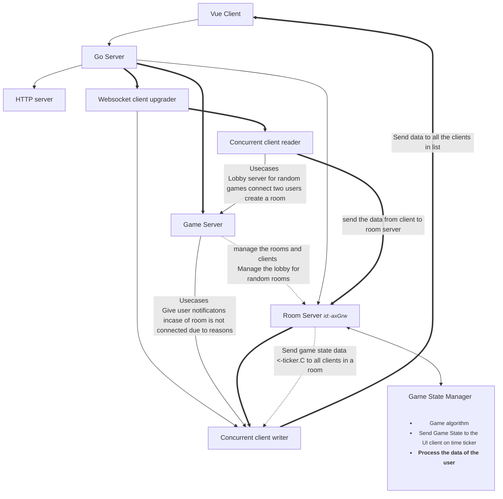

# WordsBattle

MiniWordGames is an engaging multiplayer word game that combines the thrill of real-time battles with the challenge of word creation. This project utilizes Golang for the backend server, Vue.js for the frontend application, WebSocket for real-time communication, and Docker for easy deployment. The game is hosted under the domain [miniwordgames.com](https://miniwordgames.com).

## Tech Stack  
    	 

## Features

- **Real-time Battles:** Challenge your friends or random opponents to fast-paced word battles.
- **WebSocket Integration:** Enjoy seamless and instant communication between players for a responsive gaming experience.
- **Golang Backend:** Utilizes the power of Golang to handle server-side logic efficiently.
- **Vue.js Frontend:** A dynamic and interactive user interface designed with Vue.js for a smooth gaming experience.
- **Dockerized Multistaged Deployment:** Easily deploy and manage the application using Docker containers which are small and lightweight.


## Architecture  

## Demo

https://youtu.be/-9HrFUU_jfs?si=RhmSZE6-uSq-6M8f  
Live :- http://miniwordgames.com

## Project Setup
wordsbattle uses Docker for deployment and project creation you can find docker-compose.yaml  in repo .

```
git clone git@github.com:DhruvikDonga/wordsbattle.git
cd miniwordgames

docker-compose build
docker-compose up
```

## Interested to contribute 
Checkout this issue :- https://github.com/DhruvikDonga/wordsbattle/issues/12 
Dev Branch :- https://github.com/DhruvikDonga/wordsbattle/tree/WB-8

## Authors

- [@Dhruvik D.](https://www.github.com/DhruvikDonga)

